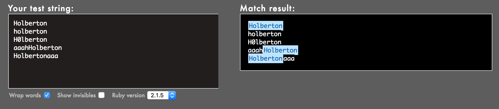

# Project: 0x06. Regular expression


## Background Context
* For this project, you have to build your regular expression using Oniguruma, a regular expression library that which is used by Ruby by default. Note that other regular expression libraries sometimes have different properties.
* Because the focus of this exercise is to play with regular expressions (regex), here is the Ruby code that you should use, just replace the regexp part, meaning the code in between the //:
```sh
sylvain@ubuntu$ cat example.rb
#!/usr/bin/env ruby
puts ARGV[0].scan(/127.0.0.[0-9]/).join
sylvain@ubuntu$
sylvain@ubuntu$ ./example.rb 127.0.0.2
127.0.0.2
sylvain@ubuntu$ ./example.rb 127.0.0.1
127.0.0.1
sylvain@ubuntu$ ./example.rb 127.0.0.a
```
* Install with ruby with: `sudo apt install ruby-full`

## Resources

#### Read or watch:

* [Regular expressions - basics](https://www.slideshare.net/neha_jain/introducing-regular-expressions)
* [Regular expressions - advanced](https://www.slideshare.net/neha_jain/advanced-regular-expressions-80296518)
* [Rubular is your best friend](https://rubular.com/)
* [Use a regular expression against a problem: now you have 2 problems](https://blog.codinghorror.com/regular-expressions-now-you-have-two-problems/)
* [Learn Regular Expressions with simple, interactive exercises](https://regexone.com/)

## Description of what each file shows (Tasks):
* project_aid	--- folder that contains concept to better understand the project and JPEGs for README.
* Files that start with:
0. [Simply matching School](./0-simply_match_school.rb):


* Requirements:
	- The regular expression must match `School`
	- Using the project instructions, create a Ruby script that accepts one argument and pass it to a regular expression matching method
- Example:
	```sh
	kazzywiz@Kazzywiz:~/alx-system_engineering-devops/0x06-regular_expressions$ ./0-simply_match_school.rb School | cat -e
	School$
	kazzywiz@Kazzywiz:~/alx-system_engineering-devops/0x06-regular_expressions$ ./0-simply_match_school.rb "Best School" | cat -e
	School$
	kazzywiz@Kazzywiz:~/alx-system_engineering-devops/0x06-regular_expressions$ ./0-simply_match_school.rb "School Best School" | cat -e
	SchoolSchool$
	kazzywiz@Kazzywiz:~/alx-system_engineering-devops/0x06-regular_expressions$ ./0-simply_match_school.rb "Grace Hopper" | cat -e
	$
	kazzywiz@Kazzywiz:~/alx-system_engineering-devops/0x06-regular_expressions$ 
	```
1. [Repetition Token #0](./1-repetition_token_0.rb) :


* Requirements:
	- Find the regular expression that will match the above cases
	- Using the project instructions, create a Ruby script that accepts one argument and pass it to a regular expression matching method
* The [website](regex101.com) is awesome to test out how exactly it works. So we just insert the test string from the image above (left part) and then put in the regular expression `hbt{2,5}n` and see how it matches.
2. [Repetition Token #1](./2-repetition_token_1.rb) :


* Requirements:
	- Find the regular expression that will match the above cases
	- Using the project instructions, create a Ruby script that accepts one argument and pass it to a regular expression matching method
3. [Repetition Token #2](./3-repetition_token_2.rb) :


* Requirements:
	- Find the regular expression that will match the above cases
	- Using the project instructions, create a Ruby script that accepts one argument and pass it to a regular expression matching method

| Task | File |
| ---- | ---- |
| 4. Repetition Token #3 | [4-repetition_token_3.rb](./4-repetition_token_3.rb) |
| 5. Not quite HBTN yet | [5-beginning_and_end.rb](./5-beginning_and_end.rb) |
| 6. Call me maybe | [6-phone_number.rb](./6-phone_number.rb) |
| 7. OMG WHY ARE YOU SHOUTING? | [7-OMG_WHY_ARE_YOU_SHOUTING.rb](./7-OMG_WHY_ARE_YOU_SHOUTING.rb) |
