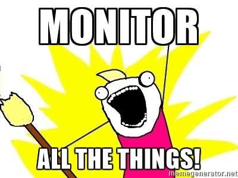

# Project: 0x18. Webstack monitoring

## Concepts

For this project, we expect you to look at these concepts:

- [Monitoring](./concepts/monitoring.md)
- [Server](./concepts/server.md)


## Background Context

“You cannot fix or improve what you cannot measure” is a famous saying in the Tech industry. In the age of the data-ism, monitoring how our Software systems are doing is an important thing. In this project, we will implement one of many tools to measure what is going on our servers.

Web stack monitoring can be broken down into 2 categories:

- Application monitoring: getting data about your running software and making sure it is behaving as expected
- Server monitoring: getting data about your virtual or physical server and making sure they are not overloaded (could be CPU, memory, disk or network overload)



## Resources

### Read or watch:-

- [What is server monitoring](https://www.sumologic.com/glossary/server-monitoring/)
- [What is application monitoring](https://en.wikipedia.org/wiki/Application_performance_management)
- [System monitoring by Google](https://sre.google/sre-book/monitoring-distributed-systems/)
- [Nginx logging and monitoring](https://docs.nginx.com/nginx/admin-guide/monitoring/logging/)

## Learning Objectives

### General

- Why is monitoring needed
- What are the 2 main area of monitoring
- What are access logs for a web server (such as Nginx)
- What are error logs for a web server (such as Nginx)

## Tasks

0. [Sign up for Datadog and install datadog-agent](./README.md) :

For this task head to [https://www.datadoghq.com/](https://www.datadoghq.com/) and sign up for a free `Datadog` account. When signing up, you’ll have the option of selecting statistics from your current stack that `Datadog` can monitor for you. Once you have an account set up, follow the instructions given on the website to install the `Datadog` agent.

- Sign up for Datadog - **Please make sure you are using the US website of Datagog (https://app.datadoghq.com)**
- Also,🙏🏽make sure to use the US1 East region. EAST!!!
- Use the US1 region
- Install `datadog-agent` on `web-01`
- Create an `application key` (see this [link](https://docs.datadoghq.com/account_management/api-app-keys/))
- Copy-paste in your Intranet user profile (here) your DataDog `API key` and your DataDog `application key`.
- Your server `web-01` should be visible in Datadog under the host name `XX-web-01`
  - You can validate it by using this [API](https://docs.datadoghq.com/api/latest/hosts/)
  - If needed, you will need to update the hostname of your server

Hopefully when done right, you should have something like this in your web-server:

```sh
ubuntu@user-web-01:~$ curl -X GET "https://api.datadoghq.com/api/v1/hosts" -H "Accept: application/json" -H "DD-API-KEY: <your-API-key>" -H "DD-APPLICATION-KEY: <your-APPLICATION-key>"
{"host_list":[{"id":18122929414,"tags_by_source":{"Datadog":["host:user-web-01"]},"aliases":["user-web-01","i-0cc3581601e807d22","ip-10-247-111-99.ec2.internal"],"apps":["agent","ntp"],"sources":["agent"],"name":"user-web-01","host_name":"user-web-01","aws_id":"i-0cc3581601e807d22","up":true,"last_reported_time":1707945544,"is_muted":false,"mute_timeout":null,"meta":{"cpuCores":1,"pythonV":"3.9.18","agent_flavor":"agent","agent_version":"7.50.3","install_method":{"installer_version":"install_script-1.26.0","tool":"install_script","tool_version":"install_script_agent7"},"socket-hostname":"user-web-01","gohai":"{\"cpu\":{\"cache_size\":\"30720 KB\",\"cpu_cores\":\"1\",\"cpu_logical_processors\":\"1\",\"family\":\"6\",\"mhz\":\"2399.801\",\"model\":\"63\",\"model_name\":\"Intel(R) Xeon(R) CPU E5-2676 v3 @ 2.40GHz\",\"stepping\":\"2\",\"vendor_id\":\"GenuineIntel\"},\"filesystem\":[{\"kb_size\":\"97704\",\"mounted_on\":\"/run\",\"name\":\"tmpfs\"},{\"kb_size\":\"5120\",\"mounted_on\":\"/run/lock\",\"name\":\"tmpfs\"},{\"kb_size\":\"488520\",\"mounted_on\":\"/sys/fs/cgroup\",\"name\":\"tmpfs\"},{\"kb_size\":\"106858\",\"mounted_on\":\"/boot/efi\",\"name\":\"/dev/xvda15\"},{\"kb_size\":\"97704\",\"mounted_on\":\"/run/user/1000\",\"name\":\"tmpfs\"},{\"kb_size\":\"20134592\",\"mounted_on\":\"/\",\"name\":\"/dev/root\"},{\"kb_size\":\"488520\",\"mounted_on\":\"/dev/shm\",\"name\":\"tmpfs\"}],\"memory\":{\"swap_total\":\"0kB\",\"total\":\"1000488960\"},\"network\":{\"interfaces\":[{\"ipv4\":[\"10.247.111.99\"],\"ipv4-network\":\"10.247.0.0/16\",\"ipv6\":[\"fe80::45c:d9ff:fe1f:f367\"],\"ipv6-network\":\"fe80::/64\",\"macaddress\":\"06:5c:d9:1f:f3:67\",\"name\":\"eth0\"}],\"ipaddress\":\"10.247.111.99\",\"ipaddressv6\":\"fe80::45c:d9ff:fe1f:f367\",\"macaddress\":\"06:5c:d9:1f:f3:67\"},\"platform\":{\"GOOARCH\":\"amd64\",\"GOOS\":\"linux\",\"goV\":\"1.20.12\",\"hardware_platform\":\"x86_64\",\"hostname\":\"user-web-01\",\"kernel_name\":\"Linux\",\"kernel_release\":\"5.15.0-1051-aws\",\"kernel_version\":\"#56~20.04.1-Ubuntu SMP Tue Nov 28 15:43:31 UTC 2023\",\"machine\":\"x86_64\",\"os\":\"GNU/Linux\",\"processor\":\"x86_64\"}}","nixV":["ubuntu","20.04",""],"fbsdV":["","",""],"logs_agent":{"auto_multi_line_detection_enabled":false,"transport":""},"platform":"linux","timezones":["UTC"],"socket-fqdn":"localhost","winV":["","",""],"processor":"Intel(R) Xeon(R) CPU E5-2676 v3 @ 2.40GHz","network":{"network-id":"vpc-0f51479a890b0bef7","public-ipv4":"100.26.11.61"},"machine":"amd64","agent_checks":[["disk","disk","disk:67cc0574430a16ba","OK","",""],["ntp","ntp","ntp:3c427a42a70bbf8","OK","",""],["network","network","network:4b0649b7e11f0772","OK","",""],["uptime","uptime","uptime","OK","",""],["io","io","io","OK","",""],["file_handle","file_handle","file_handle","OK","",""],["cpu","cpu","cpu","OK","",""],["memory","memory","memory","OK","",""],["load","load","load","OK","",""]],"macV":["","",""],"host_id":18122929414},"metrics":{"cpu":1.3630431,"iowait":0.7366424,"load":0.008444444}}],"total_returned":1,"total_matching":1,"exact_total_matching":true}
ubuntu@user-web-01:~$
```

| Task                    | File                                 |
| ----------------------- | ------------------------------------ |
|                         |
| 1. Monitor some metrics | [SOON](./)                           |
| 2. Create a dashboard   | [2-setup_datadog](./2-setup_datadog) |
